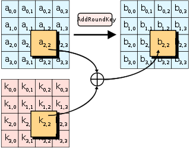
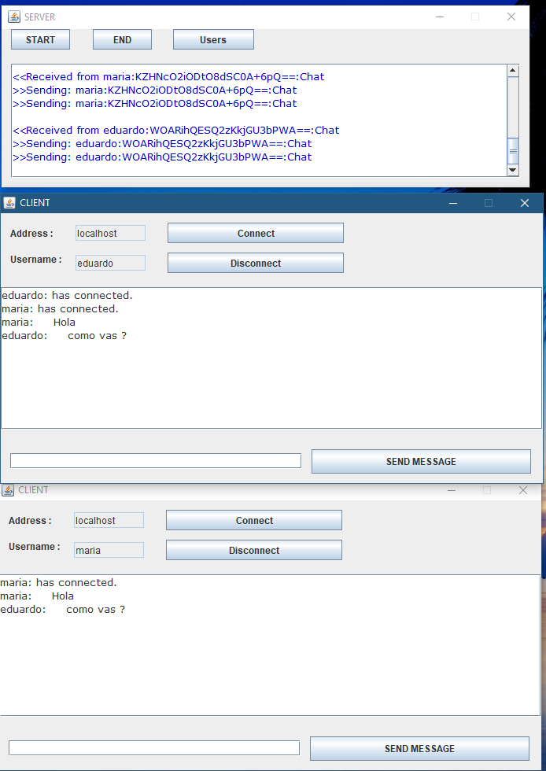

# Chat-cifrado

##Integrantes:
* Andres Sotelo
* Johan Rueda
* Eduardo Arias
* Juan Herrera

El chat esta hecho en Java Netbeans con Sockets.

Al ser un socket es un medio de transmisión bidireccional orientado a respuestas rápidas.

El cliente debe saber la ip del servidor para transmitir.

* El programa servidor lo que hace es comenzar a "Escuchar" en un puerto determinado que especificaremos 
* El programa Cliente debe conocer la ip o el nombre del dominio  del sevidor para poder solicitar la conexion con este y poder empezar el chat 

# AES

Esta basado en permutaciones y transformaciones lineales, ejecutadas varias veces en bloques de datos de 16 bytes.
Un cambio en un bit , ya sea en la clave o en el mensaje resulta en un bloque de texto cifrado diferente.

# Funcionamiento

En terminos generales el servidor solo transmite informacion general como los usuarios conectados y retransmite los mensajes sin hacer alguna operacion. También acciones como conectar y desconectar.

En el caso del cliente hay una clase cifrado que se encarga de cifrar y descifrar los mensajes:

y que es utilizado por la clase de cliente:

# Uso

Debemos iniciar el proyecto de servidor , dar click en start e iniciar los de clientes y conectar. (Se puede utilizar localhost) Click en conectar y ya se podrá utilizar el chat.

